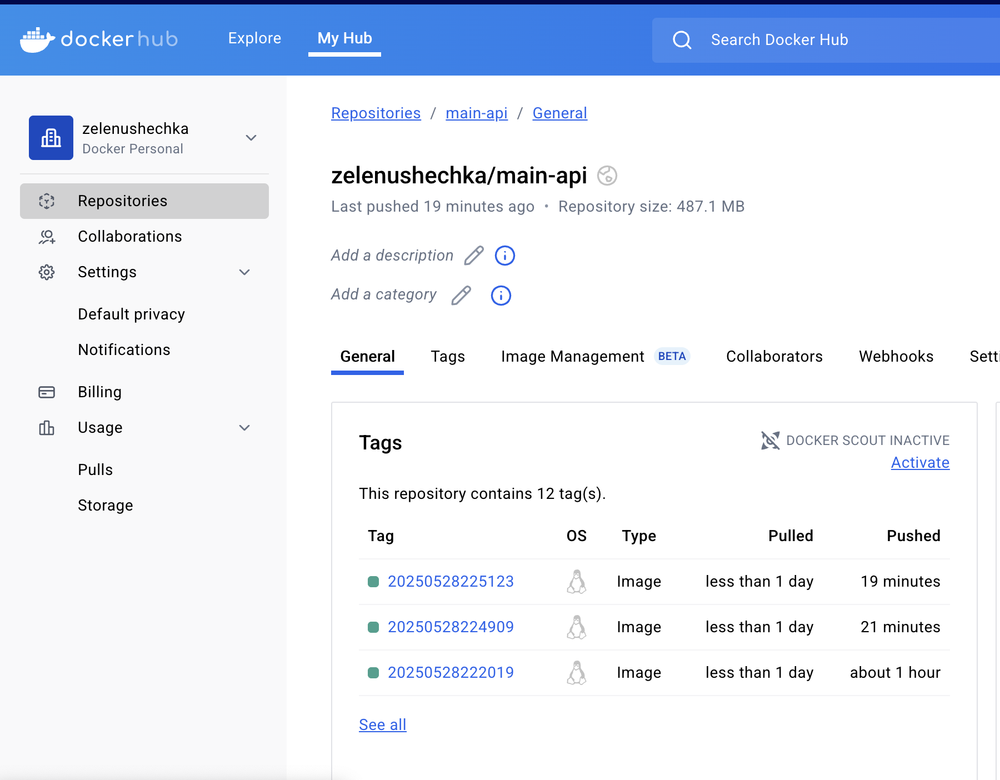
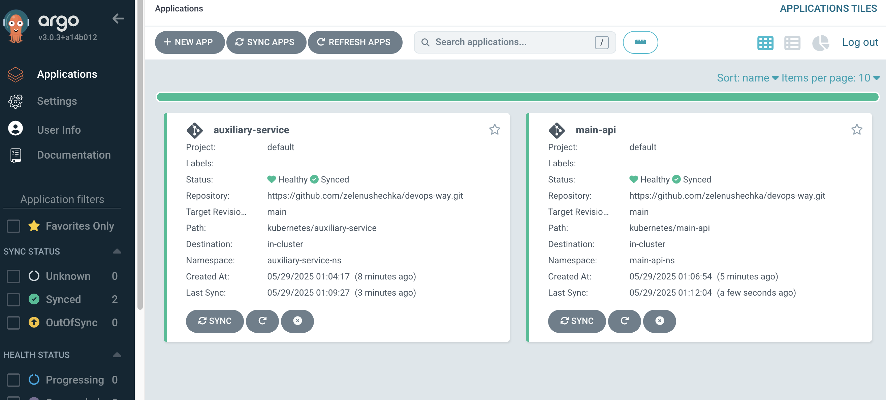
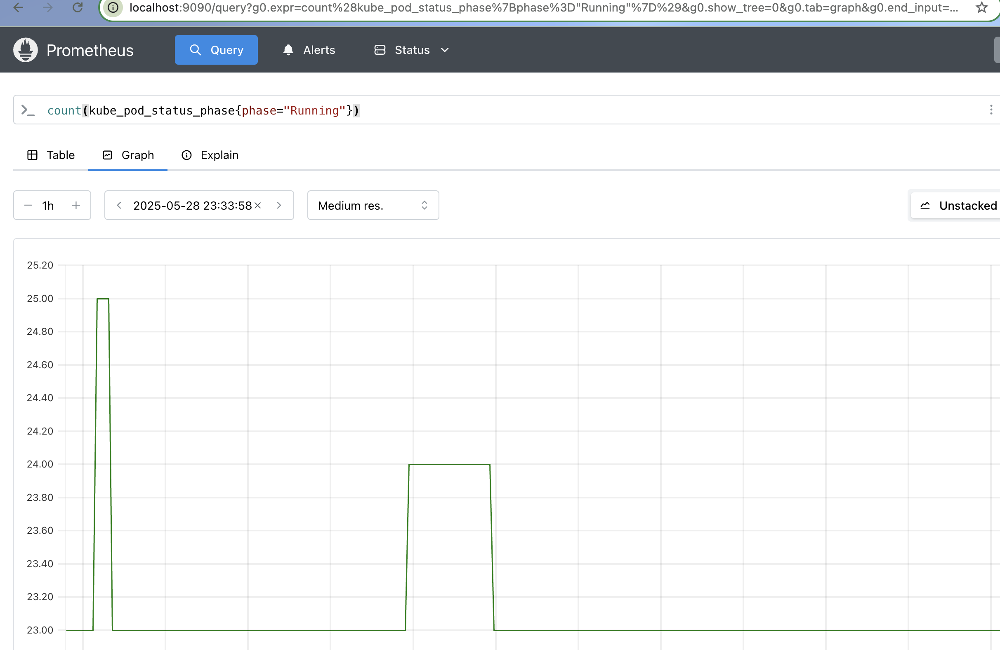
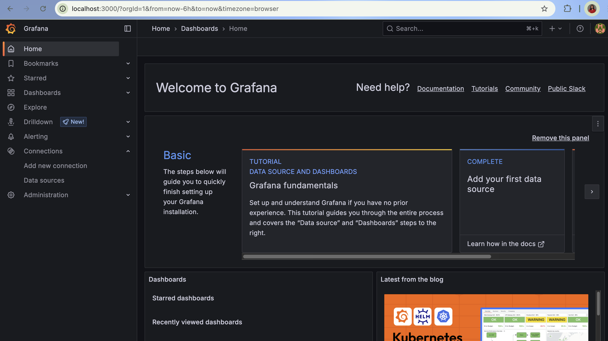
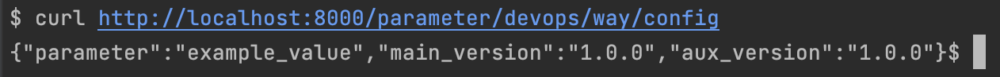
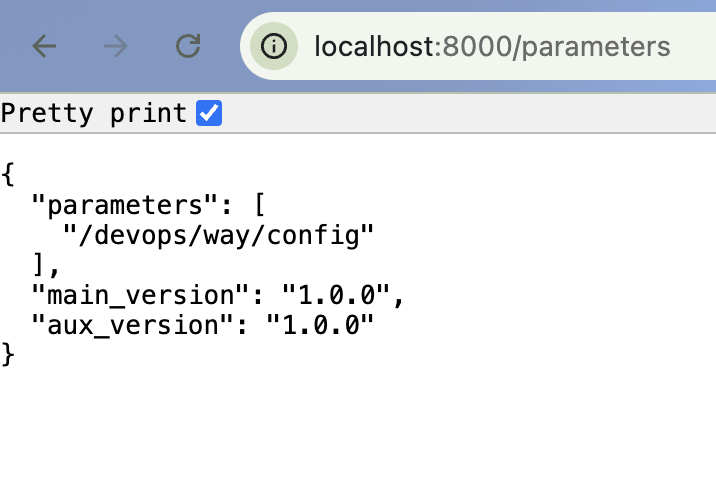
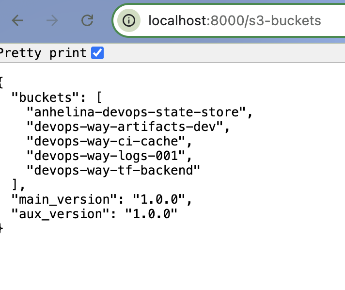

# 🌍 1. Terraform Deployment

## 📌 Overview
Deploy the **AWS infrastructure** using **Terraform**, including **S3 storage, IAM policies, and AWS Parameter Store**.

---

## ⚙️ 1. Prerequisites

Ensure you have:
- **Terraform** (≥ v1.0) installed → [Download Terraform](https://developer.hashicorp.com/terraform/downloads)
- **AWS CLI** installed → [Download AWS CLI](https://aws.amazon.com/cli/)
- **IAM access** to create resources (S3, Parameter Store, IAM policies)

---

##  2. Terraform Setup

###  **Clone the Repository**
```sh
git clone https://github.com/zelenushechka/devops-way.git
cd devops-way/terraform
```
###  **Initialize Terraform**
```sh
terraform init
```
###  **Review the Execution Plan**
```sh
terraform plan
```
###  **Apply the Infrastructure**
```sh
terraform apply -auto-approve
```

## 🏗️ 3. Infrastructure Breakdown
###  S3 Buckets
These buckets provide storage for logs, state files, CI/CD caching.
Created using `aws_s3_bucket`
**List Created Buckets**
```sh
aws s3 ls
```
### AWS Parameter Store
Manages configuration values securely.
Created using aws_ssm_parameter
Used for environment variables
**Retrieve Parameter**
```sh
aws ssm get-parameter --name "/devops/way/config" --query "Parameter.Value"
```
### IAM User & Policy
Manages authentication for accessing S3 and Parameter Store.
User: devops-way-aws-user
Policy allows:
- S3 → List buckets
- SSM → Fetch parameters
**Check IAM Policy**
```sh
aws iam get-user-policy --user-name devops-way-aws-user --policy-name devops-way-aws-policy
```

##🔥 4. Destroying the Infrastructure
If you need to delete all resources, run:
```sh
terraform destroy -auto-approve
```


# 🔧 CI/CD Pipeline Documentation

Implement  CI/CD pipeline for the project using GitHub Actions. The pipeline is designed following industry best practices and automates the following tasks:

- **Building and pushing Docker images** to a container registry.
- **Automatically updating Kubernetes deployments** when a new image is pushed.
- **(Optionally) Updating a ConfigMap** or equivalent to reflect the current service version.
- **Securely connecting to AWS** from GitHub Actions using GitHub’s OpenID Connect (OIDC), avoiding the need for static credentials.

---

## 📌 1. Overview

The GitHub Actions workflow (named **Build & Deploy**) consists of three main jobs:

1. **Build and Push Docker Images**  
2. **Update Kubernetes Deployments & Commit Changes**  
3. **Authenticate with AWS using GitHub OIDC**  

##  Pipeline Walk-through

### 1. Build and Push Docker Images
- **Checkout Repository**: The pipeline starts with checking out the code.
- **Generate Image Tags**: A unique timestamp-based tag is created and stored as an output.
- **Login & Build**:
  - Login to Docker Hub using secrets.
  - Build and push Docker images for the Main API (using `Dockerfile.main`) and Auxiliary Service (using `Dockerfile.auxiliary`).

### 2. Update Kubernetes Deployments
- **Checkout Repository**: A fresh copy is obtained.
- **Update YAML Files**:
  - Update `main-deployment.yaml` (in `kubernetes/main-api`) using the new image tag.
  - Update `auxiliary-deployment.yaml` (in `kubernetes/auxiliary-service`).
- **Commit & Push**: The updated files are committed to Git and pushed, triggering deployment sync (e.g., via ArgoCD).

### 3. AWS Integration via GitHub OIDC
- **Configure AWS Credentials**: Uses GitHub’s OIDC integration (via `aws-actions/configure-aws-credentials@v4`) to set up short-lived AWS credentials.
- **Verify AWS Authentication**: Confirmation is done using `aws sts get-caller-identity`.

## Security and Best Practices
- **Secrets Management**: All sensitive credentials are stored in GitHub Secrets.
- **OIDC Integration**: Securely connects to AWS without static credentials.
- **Separation of Concerns**: Jobs are clearly divided for easier maintenance and troubleshooting.



## Summary
- **Automation**: Docker images for the Main API and Auxiliary Service are automatically built and pushed.
- **Deployment**: Kubernetes deployment files are updated with the new image tags.
- **Security**: AWS connection is handled securely via GitHub OIDC.
- **Best Practices**: The pipeline follows modern CI/CD and infrastructure security guidelines.


# 🌍 Kubernetes Cluster Setup

## ⚙️ 1. Prerequisites

Ensure you have:
- **Docker** installed on the machine.
- **Minikube** installed for running a local Kubernetes cluster. ([Minikube Installation](https://minikube.sigs.k8s.io/docs/start/))
- **kubectl** installed to manage the cluster.
- **Helm 3** installed for deploying charts. ([Helm Installation](https://helm.sh/docs/intro/install/))
- Sufficient system resources (CPU/RAM) for Minikube.

## 📌 2. Overview
Deploy the project into a local Kubernetes cluster (using Minikube) and include:
- **ArgoCD** for deployment management.
- Separate namespaces for the **Main API** and **Auxiliary Service**.
- **Prometheus** and **Grafana** for observability (installed via Helm).

## 3. Directory Structure
```
`--- kubernetes
   |-- auxiliary-service
   |   |-- auxiliary-argocd-app.yaml
   |   |-- auxiliary-deployment.yaml
   |   |-- auxiliary-secret.yaml
   |   `-- auxiliary-service.yaml
   `-- main-api
       |-- main-argocd-app.yaml
       |-- main-deployment.yaml
       |-- main-secret.yaml
       `-- main-service.yaml
```

## 4. Setup Steps

### 4.1 Minikube Setup
```sh
minikube start --driver=docker
kubectl get nodes
kubectl cluster-info
```
### 4.2 ArgoCD Installation
```sh
kubectl create namespace argocd
helm repo add argo https://argoproj.github.io/argo-helm
helm repo update
helm install argocd argo/argo-cd --namespace argocd
kubectl create namespace devops-app
kubectl port-forward svc/argocd-server -n argocd 8080:443
```
Retrieve the ArgoCD admin password:
```sh
kubectl -n argocd get secret argocd-initial-admin-secret -o jsonpath="{.data.password}" | base64 -d
```
Access the ArgoCD UI at https://localhost:8080/.


### 4.3 Prometheus Installation
```sh
helm repo add prometheus-community https://prometheus-community.github.io/helm-charts
helm repo update
helm install prometheus prometheus-community/prometheus --namespace monitoring --create-namespace
kubectl get pods -n monitoring
```
Port-forward to access Prometheus:
```sh
export POD_NAME=$(kubectl get pods -n monitoring -l "app.kubernetes.io/name=prometheus,app.kubernetes.io/instance=prometheus" -o jsonpath="{.items[0].metadata.name}")
kubectl -n monitoring port-forward $POD_NAME 9090
```
Access the Prometheus UI at http://localhost:9090/.



### 4.4 Grafana Installation
```sh
helm repo add grafana https://grafana.github.io/helm-charts
helm repo update
helm install grafana grafana/grafana --namespace monitoring
kubectl get pods -n monitoring
kubectl port-forward svc/grafana -n monitoring 3000:80
```
Retrieve Grafana's admin password:
```sh
kubectl get secret --namespace monitoring grafana -o jsonpath="{.data.admin-password}" | base64 --decode ; echo
```
Access Grafana at http://localhost:3000/ (default username: admin).



### 4.5 Create Kubernetes Namespaces
Create separate namespaces for deployments:
```sh
kubectl create namespace main-api-ns
kubectl create namespace auxiliary-service-ns
```
### 4.6 Deploy Kubernetes Resources
Apply the configuration files from the repository:
For the Main API:
```sh
kubectl apply -f kubernetes/main-api -n main-api-ns
```
For the Auxiliary Service:
```sh
kubectl apply -f kubernetes/auxiliary-service -n auxiliary-service-ns
```
## 5. Summary
Minikube creates a local Kubernetes cluster.
ArgoCD (in the argocd namespace) manages deployment configurations from the YAML files in kubernetes/main-api and kubernetes/auxiliary-service.
Prometheus and Grafana (in the monitoring namespace) provide observability and dashboards.
Kubernetes resources are deployed using kubectl apply -f commands on the respective directories.


# 🌍 Microservices Implementation

## 📌 Overview
Implement two microservices using Python and FastAPI:

- **Main API**: Exposes endpoints to list S3 buckets, list all AWS Parameter Store parameters, and retrieve a specific parameter's value.
- **Auxiliary Service**: Handles direct AWS interactions (using boto3) to fetch S3 buckets and Parameter Store data.

Each API response includes both the Main API version and the Auxiliary Service version for traceability.

## Directory Structure
```
`-- app
   |-- Dockerfile.auxiliary
   |-- Dockerfile.main
   |-- auxiliary_service.py
   |-- main_api.py
   `-- requirements.txt
```


## Endpoints Summary

### Main API (main_api.py)
- **GET /s3-buckets**  
  Lists all S3 buckets.
- **GET /parameters**  
  Lists all parameters from AWS Parameter Store.
- **GET /parameter/{param_name}**  
  Retrieves the value of a specific parameter.


Each response includes:
- `main_version`: e.g. "1.0.0" (Main API version)
- `aux_version`: e.g. "1.0.0" (Auxiliary Service version)




## Summary
- **Separation of Concerns**: The Auxiliary Service handles AWS interactions while the Main API aggregates responses and adds version information.
- **Versioning**: Both services include version information in all responses for clarity.
- **FastAPI**: Provides a lightweight, efficient framework for building these RESTful services.

This design ensures modularity, eases debugging, and facilitates independent version management for each service.
